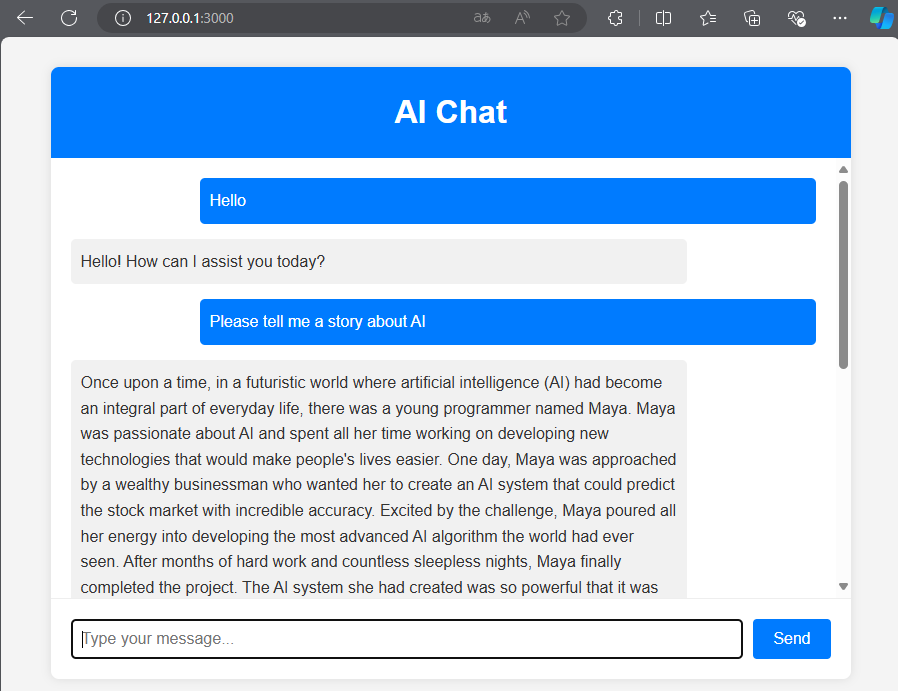

## This is a simple chat demo using openai and write with cursor AI 

This demo includes the proxy (127.0.0.1:7890) to access openai API. You can change the proxy to your own proxy if you have one.

Install dependencies

node --version to check node version and if node is available

npm install openai dotenv     
npm install https-proxy-agent     


make a .evn file on the same folder as package.json and add the following line
OPENAI_API_KEY=your license key from openai


```
cd /projects/javascript
node src/index.js
```

After success run the project, you can see the following message in the terminal
Server running on http://localhost:3000

then open http://localhost:3000 in your browser


